# Architecture: evidence-grounded enquiry triage

This design separates probabilistic language interpretation from deterministic operational routing. Solid lines show the working prototype; dashed lines show the production integrations and controls I would add next.

```mermaid
flowchart LR
    A["Client web form"] --> B["POST /api/triage"]
    B --> C["Zod intake validation"]
    C --> D["Canonical enquiry"]
    D --> E["Intake-only company dossier"]
    P["CRM / verified company sources"] -. "production enrichment" .-> E

    E --> F{"Classifier adapter"}
    F -->|"Gateway credentials present"| G["GPT-5.6 Terra via Vercel AI Gateway"]
    F -->|"Explicit baseline mode"| H["Local evidence rules"]
    G -. "provider or output failure" .-> H

    G --> I["Structured classification + evidence"]
    H --> I
    I --> J["Evidence integrity validation"]
    J --> K["Versioned deterministic routing policy"]

    K -->|"clear service-line route"| L["Service-line team lead"]
    K -->|"ambiguous, invalid, or fallback"| M["Junior analyst queue"]
    M -->|"approve or correct service line"| L
    L -->|"confirm complexity or return"| M

    M --> N["Feedback event"]
    L --> N
    N --> O["Browser-local state in prototype"]
    N -. "production" .-> Q["Postgres decision + audit event store"]
    L -. "production" .-> R["CRM / email / Teams outbox"]
    Q -.-> S["Evaluation, monitoring, and model governance"]
```

## Data flow and control boundaries

1. **Ingest.** The public form collects the four substantive fields in the brief: description, industry, company size, and urgency. Operational metadata is retained in the canonical enquiry but excluded from the model-facing intake payload. Zod rejects malformed or incomplete requests before classification.
2. **Enrich.** The live form currently creates an intake-only company dossier. External research is deliberately optional because the brief does not guarantee a reliable company identifier. The adapter boundary can later accept CRM account data or verified company sources without changing the classifier or router.
3. **Classify.** The hosted path uses `openai/gpt-5.6-terra` through Vercel AI Gateway and requests a schema-constrained object. It returns a primary and optional secondary service line, complexity, use case, missing information, alternatives, decision factors, evidence, and an explicit review signal.
4. **Validate.** Independent code confirms that decision factors reference returned evidence, intake citations use canonical fields, company citations resolve to supplied sources, and the primary route has non-contextual support. Structural validity is necessary but does not prove that the semantic judgment is correct.
5. **Route.** Versioned deterministic rules map the primary service line to a team lead, assign priority from urgency, add consulting teams, and decide whether a junior analyst is required. Complexity informs team-lead scoping and never silently changes the owner.
6. **Review and feedback.** Analysts can approve or correct the service line. Team leads confirm complexity, accept the handoff, or return it. The prototype stores these actions in browser-local storage; production would persist the original decision and subsequent human events separately.

## Model and API choices

- **Structured model call:** A constrained output contract is easier to validate, evaluate, and integrate than free-form prose. The model interprets language; it does not directly choose operational destinations.
- **GPT-5.6 Terra:** It is a benchmark candidate for a short-text classification task because it balances capability and cost and supports structured output. It is not treated as the final production winner without a representative multi-model evaluation.
- **Vercel AI Gateway:** It fits the deployment surface and provides a stable adapter for usage tracking, budgets, model comparison, and future provider failover. The current prototype uses one hosted model plus a local application fallback.
- **Local baseline:** The deterministic evidence classifier makes the application demonstrable without credentials and provides a reproducible degraded mode. When a live call fails, its result is explicitly marked as fallback and forced to human review.
- **Next.js, TypeScript, Zod:** One runtime covers the web experience, server API, schemas, and tests. Python would become useful for offline labeling, batch evaluation, statistical analysis, or a dedicated ML service at greater scale.

## Integration points

- **Inbound:** Existing web form, CRM form, email parser, or service-management webhook mapped into the canonical enquiry schema.
- **Company context:** CRM account record first; verified registry and company sources second. Every added fact needs source, retrieval time, trust tier, and identity confidence.
- **Destinations:** CRM ownership queues, Microsoft Teams, email, or work-management systems. Production delivery should use transactional outbox events so a successful route cannot be lost between the database and notification provider.
- **Identity and access:** SSO, role-based access, tenant isolation, and least-privilege service credentials.
- **Data lifecycle:** Encrypted Postgres records, immutable decision and feedback events, explicit retention/deletion rules, and PII redaction before model calls where required.

## Instrumentation from day one

I would attach one trace ID to the intake, enrichment, model call, evidence validation, route, notification, and feedback events. The minimum operational dashboard would include:

- provider success, error category, latency, token usage, and cost per enquiry;
- service-line distribution and drift by source, industry, and time period;
- auto-route precision, automation coverage, review capture, and unnecessary-review rate;
- analyst override rate, team-lead return rate, and disagreement by service line;
- evidence-validation failures and unsupported-fact incidents;
- enrichment coverage, source freshness, identity confidence, and cases helped or harmed;
- analyst backlog, age, and time-to-team-lead handoff; and
- model, prompt, taxonomy, schema, and routing-policy versions for every decision.

Model or policy changes would run in shadow against a frozen evaluation set before rollout. Releases would be versioned, reversible, and gated on pre-agreed precision and evidence-validity thresholds.

## Explicit prototype assumptions

- The six service lines and fictional lead assignments are hypotheses, not AIVC's confirmed organization design.
- One lead owns each service line; geography, capacity, specialization, and account ownership are not modeled.
- The balanced policy reviews route ambiguity and integrity failures. Conservative mode also reviews broader scope and incomplete context. Aggressive mode is currently equivalent to balanced and should be treated as a UI placeholder until a distinct, tested rule is defined.
- External company research, durable storage, authentication, notifications, and production observability are adapter designs rather than completed integrations.
